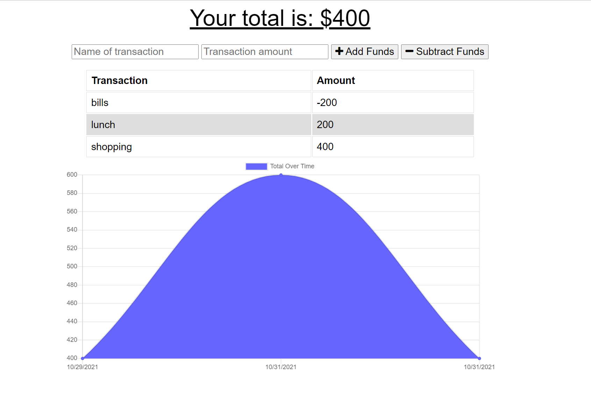

# Budget Tracker
A Budget Tracker application that allows users to add their expenses to their budgets(with/without an interet connection). 

## Table of Contents

* [Installation](#installation)
* [Usage](#usage)
* [Links](#Links)
* [License](#License)

## Installation

1. Download the repository
2. `npm install` to install the required npm packages to run
3. Run `npm start`

## Usage

* Open your browser and go to : `http://localhost:3000`

* User can add transactions by inputting the following:
  * Transaction Name
  * Transaction Amount
  * For deposits - select add funds
  * For expenses - select subtract funds 

* The total amount is reflected
* The app can be used online or offline, where the offline functionality are:
  * Enter deposits offline
  * Enter expenses offline

* See below example: The graph portrays the total funds over time by date entered for each transaction

  

## Links

* [Github](https://github.com/nerink/budget-tracker)
* [Live Heroku App](https://sheltered-dusk-18625.herokuapp.com/)

## License

  Licensed under the [MIT](LICENSE) license.
  